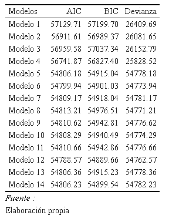

background-image: url("assets/logo/logo.png")
background-size: 15%
background-position: 100% 0%

```{r, load_refs, echo=FALSE, cache=FALSE, message=FALSE, warning=F}
# library(RefManageR)
# BibOptions(check.entries = FALSE, 
#            bib.style = "authoryear", 
#            cite.style = 'authoryear', 
#            style = "markdown",
#            hyperlink = FALSE, 
#            dashed = FALSE)
# myBib <- ReadBib("assets/example.bib", check = FALSE)
library(icons)
top_icon = function(x) {
  icons::icon_style(
    icons::fontawesome(x),
    position = "fixed", top = 10, right = 10
  )
}

library(tidyverse)
library(knitr)
library(kableExtra)
library(sjPlot)
library(lme4)
```

background-image: url("assets/logo/logo.png")
background-size: 15%
background-position: 100% 0%

## ¿Qué se abordará en esta presentación?

<br>
<br>
<br>

--

- Antecedentes 

--

- Objetivos e hipótesis de investigación

--

- Metodología

--

- Análisis preliminar

--

- Conclusiones

---
background-image: url("assets/logo/logo.png")
background-size: 15%
background-position: 100% 0%

## Antecedentes  

<br>
<br>
<br>
<br>

- Explotación y enajenación: discutiendo la pérdida de la centralidad del trabajo
--
<br>
- Clase y conciencia: posición, articulación y conflicto
--
<br>
- El trabajo asalariado en el neoliberalismo
--
<br>
- Política de clases e instituciones

---
background-image: url("assets/logo/logo.png")
background-size: 15%
background-position: 100% 0%

## Objetivos de investigación 

<br>

### Objetivo **general**

.content-box-red[

Analizar el **efecto** de factores de nivel **individual** y **contextual** asociados a las relaciones de clase en las actitudes hacia el trabajo remunerado

]

--


### Objetivos **específicos**

.content-box-red[

- Determinar el efecto de la *posición de clase* en la actitud mercantilizada hacia el trabajo remunerado. 
- Determinar el efecto de los *recursos de poder de la clase trabajadora* (estructural, asociativo y político-institucional) en la actitud mercantilizada hacia el trabajo remunerado. 
- Analizar el *efecto conjunto* de la posición de clase y los recursos de poder de la clase trabajadora en la actitud mercantilizada hacia el trabajo remunerado.

]
---
background-image: url("assets/logo/logo.png")
background-size: 15%
background-position: 100% 0%

## Hipótesis


<br>
<br>
<br>

.content-box-red[

- El sometimiento simultáneo a diversos tipos de explotación estará asociado a una actitud hacia el trabajo más mercantilizada. 
- Un mayor Índice de Poder Obrero (IPO) estará asociado a una actitud hacia el trabajo más mercantilizada.
- Incorporando factores contextuales, el poder explicativo de la posición de clase respecto de la actitud mercantilizada hacia el trabajo tendería a reducirse. 

]

---
background-image: url("assets/logo/logo.png")
background-size: 15%
background-position: 100% 0%

## Metodología

### Datos

- ISSP Work Orientations IV (2015)
  + 25 países
  + 17.610 observaciones

- Variable *dependiente*: **Actitud mercantilizada hacia el trabajo**
  + *A job is just a way of earning money – no more*
  + Item tipo Likert con 5 niveles 
  + Valor más bajo indica mayor grado de acuerdo
  
- Variables *predictoras*: 
  + Nivel 1: **Posición de clase** 
  + Nivel 2: **Índice de Poder Obrero (IPO)**, promedio de valores estandarizados para el Poder Potencial de los trabajadores (Rudra, 2003), la densidad sindical y el Índice de Derechos Laborales (Kucera y Sari, 2019)
  
---
background-image: url("assets/logo/logo.png")
background-size: 15%
background-position: 100% 0%

## Metodología

### Análisis bivariado

```{r, include=F, warning=F}
data = readRDS(url("https://github.com/nicolasggodoym/tesis/raw/main/output/data/data.rds"))
```

```{r echo=FALSE}
data %>% 
  group_by(clase) %>%
  summarise(ci = round(mean(job_money, na.rm = T),3)) %>% 
  ungroup() %>% 
  kable(caption = "Media de Índice de actitud mercantilizada hacia el trabajo según clase social",
        format = "html",
        col.names = c("Posición de clase", 
                      "Media de actitud mercantilizada hacia el trabajo")) %>% 
  kable_classic(full_width = F,
                html_font = "Times New Roman") %>% 
  footnote("Elaboración propia",
           general_title = "Fuente :") 
```

---
background-image: url("assets/logo/logo.png")
background-size: 15%
background-position: 100% 0%

## Metodología

### Análisis bivariado

```{r, echo = F}
data %>% 
  group_by(country) %>%
  summarise(plp_std = round(mean(plp_std),3),
            den_std = round(mean(den_std), 3),
            lri_std = round(mean(lri_std), 3),
            ipo = round(mean(ipo), 3)) %>% 
  ungroup() %>% #Transformamos en dataframe para manipular con dplyr
  .[1:10,] %>% 
  kable(caption = "Distribución de variables macro según país (1-10)",
        format = "html",
        col.names = c("País", "P.P.T.", "Densidad sindical", 
                      "Índice de derechos Laborales",
                      "Índice de Poder Obrero")) %>% 
  kable_classic(full_width = F,
                html_font = "Times New Roman") %>% 
  footnote("Elaboración propia",
           general_title = "Fuente :") 
```
---
background-image: url("assets/logo/logo.png")
background-size: 15%
background-position: 100% 0%

## Metodología


```{r, echo = F}
data %>% 
  group_by(country) %>%
  summarise(plp_std = round(mean(plp_std),3),
            den_std = round(mean(den_std), 3),
            lri_std = round(mean(lri_std), 3),
            ipo = round(mean(ipo), 3)) %>% 
  ungroup() %>% #Transformamos en dataframe para manipular con dplyr
  .[11:19,] %>% 
  kable(caption = "Distribución de variables macro según país (11-19)",
        format = "html",
        col.names = c("País", "P.P.T.", "Densidad sindical", 
                      "Índice de derechos Laborales",
                      "Índice de Poder Obrero")) %>% 
  kable_classic(full_width = F,
                html_font = "Times New Roman") %>% 
  footnote("Elaboración propia",
           general_title = "Fuente :") 
```

---
background-image: url("assets/logo/logo.png")
background-size: 15%
background-position: 100% 0%

## Metodología


```{r, echo = F}
data %>% 
  group_by(country) %>%
  summarise(plp_std = round(mean(plp_std),3),
            den_std = round(mean(den_std), 3),
            lri_std = round(mean(lri_std), 3),
            ipo = round(mean(ipo), 3)) %>% 
  ungroup() %>% #Transformamos en dataframe para manipular con dplyr
  .[20:25,] %>% 
  kable(caption = "Distribución de variables macro según país (20-25)",
        format = "html",
        col.names = c("País", "P.P.T.", "Densidad sindical", 
                      "Índice de derechos Laborales",
                      "Índice de Poder Obrero")) %>% 
  kable_classic(full_width = F,
                html_font = "Times New Roman") %>% 
  footnote("Elaboración propia",
           general_title = "Fuente :") 
```
---
background-image: url("assets/logo/logo.png")
background-size: 15%
background-position: 100% 0%

## Metodología

### Método de análisis 

- Regresión lineal multinivel (REML)
- Estimación de interceptos y pendientes aleatorias
- 14 modelos
  + 4 de nivel 1
  + 8 con interceptos y pendientes aleatorias por país
  + 1 con interceptos aleatorios
  + 1 con interceptos aleatorios y efectos fijos
- Medidas de ajuste: AIC, BIC y Devianza

---
background-image: url("assets/logo/logo.png")
background-size: 15%
background-position: 100% 0%

## Ajuste de los modelos estimados


```{r, echo = FALSE, out.height="40%", fig.height=1, out.width="40%", fig.align='center'}

```

---
background-image: url("assets/logo/logo.png")
background-size: 15%
background-position: 100% 0%

## Modelo de regresión lineal multinivel

```{r, echo = F, out.height="30%", fig.height=0.75, out.width="50%", fig.align='center'}

```

---
background-image: url("assets/logo/logo.png")
background-size: 15%
background-position: 100% 0%

## Diferencias por país

```{r, echo = F}
final_fix = lmer(job_money ~ clase + UNION + SEX +ipo+(1|country), data)

pais = sort(unique(data$country))
ipo = data %>% 
  select(pais = country, ipo) %>% 
  distinct(pais, ipo)
x <- data.frame(pais, b0 = coef(final_fix)$country)
x = merge(x, ipo, by = "pais")
x %>% 
  select(1, 2, ipo) %>% 
  mutate_at(vars(2, 3), ~(round(., 3))) %>% 
  .[1:10,] %>% 
  kable(caption = "Interceptos aleatorios estimados en el 
Modelo 12 (1)",
        format = "html",
        col.names = c("País",
                      "Intercepto aleatorio",
                      "IPO")) %>% 
  kable_classic(full_width = F,
                html_font = "Times New Roman") %>% 
  footnote("Elaboración propia",
           general_title = "Fuente :")

```

---
background-image: url("assets/logo/logo.png")
background-size: 15%
background-position: 100% 0%

## Diferencias por país

```{r, echo = F}
x %>% 
  select(1, 2, ipo) %>% 
  mutate_at(vars(2, 3), ~(round(., 3))) %>% 
  .[11:19,] %>% 
  kable(caption = "Interceptos aleatorios estimados en el 
Modelo 12 (2)",
        format = "html",
        col.names = c("País",
                      "Intercepto aleatorio",
                      "IPO")) %>% 
  kable_classic(full_width = F,
                html_font = "Times New Roman") %>% 
  footnote("Elaboración propia",
           general_title = "Fuente :")

```
---
background-image: url("assets/logo/logo.png")
background-size: 15%
background-position: 100% 0%

## Diferencias por país

```{r, echo = F}
x %>% 
  select(1, 2, ipo) %>% 
  mutate_at(vars(2, 3), ~(round(., 3))) %>% 
  .[20:25,] %>% 
  kable(caption = "Interceptos aleatorios estimados en el 
Modelo 12  (3)",
        format = "html",
        col.names = c("País",
                      "Intercepto aleatorio",
                      "IPO")) %>% 
  kable_classic(full_width = F,
                html_font = "Times New Roman") %>% 
  footnote("Elaboración propia",
           general_title = "Fuente :")

```
---

background-image: url("assets/logo/logo.png")
background-size: 15%
background-position: 100% 0%

## Resultados del análisis

<br>

### Nivel micro

- Existe una relación positiva entre el *sometimiento a múltiples tipos de explotación* y la actitud mercantilizada hacia el trabajo. 
- **Jerarquía** del efecto de los activos: autoridad, calificaciones y propiedad. 

### Nivel macro

- No parece existir relación entre intercepto aleatorio estimado y tipo de coordinación económica. 
- El efecto del IPO sobre las actitudes al trabajo son *__positivos__ y similares* entre países. 
- El poder explicativo de la posición de clase se debilita al incorporar factores contextuales en las estimaciones

---

class: fdl-black
background-image: url("assets/logo/logo-blanco.png")
background-size: 15%
background-position: 100% 0%

# ¡Gracias!

.white[*Nicolás Godoy* - Tesista de pregrado]
<a href="mailto:nicolas.godoy.m@ug.uchile.cl">
.white[`r icons::icon_style(icons::fontawesome("paper-plane"), fill = "white")` nicolas.godoy.m@ug.uchile.cl]
</a>


<a href="https://github.com/nicolasggodoym">
.white[`r icons::icon_style(icons::fontawesome("github"), fill = "white")` @nicolasggodoym]
</a>


]]

.pull-left.white.middle[
FONDECYT N°11190229<br>*Determinantes institucionales y políticos del conflicto entre empresarios y trabajadores: los casos de Argentina y Chile en perspectiva comparada*]