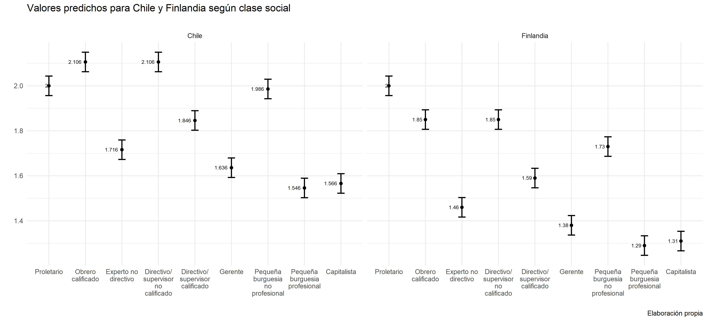

background-image: url("assets/logo/logo.png")
background-size: 15%
background-position: 100% 0%

```{r, load_refs, echo=FALSE, cache=FALSE, message=FALSE, warning=F}
# library(RefManageR)
# BibOptions(check.entries = FALSE, 
#            bib.style = "authoryear", 
#            cite.style = 'authoryear', 
#            style = "markdown",
#            hyperlink = FALSE, 
#            dashed = FALSE)
# myBib <- ReadBib("assets/example.bib", check = FALSE)
library(icons)
top_icon = function(x) {
  icons::icon_style(
    icons::fontawesome(x),
    position = "fixed", top = 10, right = 10
  )
}

library(tidyverse)
library(dplyr)
library(knitr)
library(kableExtra)
library(sjPlot)
library(lme4)
library(patchwork)
library(ggrepel)
data = readRDS(url("https://github.com/nicolasggodoym/tesis/blob/main/output/data/data.rds?raw=true"))
final_fix = lmer(job_money ~ clase + UNION + SEX +ipo+(1|country), data)
lm_clase_ci <- lm(job_money ~ clase + UNION + SEX, data = data) 
```


background-image: url("assets/logo/logo.png")
background-size: 15%
background-position: 100% 0%

## Objetivos de investigación 

<br>

### Objetivo **general**

.content-box-red[

Analizar el **efecto** de factores de nivel **individual** y **contextual** asociados a las relaciones de clase en las actitudes hacia el trabajo remunerado

]

--


### Objetivos **específicos**

.content-box-red[

- Determinar el efecto de la *posición de clase* en la actitud mercantilizada hacia el trabajo remunerado. 
- Determinar el efecto de los *recursos de poder de la clase trabajadora* (estructural, asociativo y político-institucional) en la actitud mercantilizada hacia el trabajo remunerado. 
- Analizar el *efecto conjunto* de la posición de clase y los recursos de poder de la clase trabajadora en la actitud mercantilizada hacia el trabajo remunerado.

]

---
background-image: url("assets/logo/logo.png")
background-size: 15%
background-position: 100% 0%

## Antecedentes  

<br>
<br>
<br>
<br>

- Explotación y enajenación: discutiendo la pérdida de la centralidad del trabajo
--
<br>
- Clase y conciencia: posición, articulación y conflicto
--
<br>
- El trabajo asalariado en el neoliberalismo
--
<br>
- Política de clases e instituciones


---
background-image: url("assets/logo/logo.png")
background-size: 15%
background-position: 100% 0%

## Hipótesis


<br>
<br>
<br>

.content-box-red[

- El sometimiento simultáneo a diversos tipos de explotación estará asociado a una actitud hacia el trabajo más mercantilizada. 
- Un mayor Índice de Poder Obrero (IPO) estará asociado a una actitud hacia el trabajo más mercantilizada.

- Incorporando factores contextuales, el poder explicativo de la posición de clase respecto de la actitud mercantilizada hacia el trabajo tendería a reducirse. 

]

---
background-image: url("assets/logo/logo.png")
background-size: 15%
background-position: 100% 0%

## Datos

- ISSP Work Orientations IV (2015)
  + 25 países
  + 17.610 observaciones

- Variable *dependiente*: **Actitud mercantilizada hacia el trabajo**
  + *A job is just a way of earning money – no more*
  + Item tipo Likert con 5 niveles 
  + Valor más bajo indica mayor grado de acuerdo
  
- Variables *predictoras*: 
  + Nivel 1: **Posición de clase** 
  + Nivel 2: **Índice de Poder Obrero (IPO)**, promedio de valores estandarizados para el Poder Potencial de los trabajadores (Rudra, 2003), la densidad sindical y el Índice de Derechos Laborales (Kucera y Sari, 2019)
  
---

```{r, echo = FALSE, out.height="100%", fig.height=4, out.width="100%", fig.align='center'}

```

---

```{r, echo=F, include = T, warning=F, out.width="60%", fig.align='center'}
data %>% 
  filter(if_any(c(job_money, clase, ends_with("std")), ~!is.na(.))) %>% 
  group_by(clase) %>% 
  summarise(m = mean(job_money)) %>% 
  ggplot(aes(x = clase, y = m, fill = "#FF3300")) +
  geom_bar(position = position_dodge(.2),stat = "identity", color = "black") +
  geom_text(aes(label=round(m,3)), vjust=1.5)+
  labs(title = "Media de actitud enajenada hacia el trabajo según clase social", 
       caption = "Elaboración propia en base a ISSP (2015)") +
  xlab("") +
  ylab("") + 
  scale_x_discrete(labels = function(x) str_wrap(x, width = 2)) +
  theme_classic() +
  theme(legend.position = "none")
```
---

```{r, echo=F, include = T, warning=F, out.width="60%", fig.align='center'}
data %>% 
  filter(if_any(c(job_money, clase, ends_with("std")), ~!is.na(.))) %>% 
  group_by(country) %>% 
  summarise(m = mean(job_money)) %>% 
  filter(country %in% c("Alemania", "Australia","Chile", "Dinamarca", "Eslovaquia",
                        "España", "Estados Unidos de América (los)", "Finlandia", "México",
                        "Noruega", "Rusia")) %>% 
  ggplot(aes(x = reorder(country, -m), y = m, fill = "#FF3300")) +
  geom_bar(position = position_dodge(.2),stat = "identity", color = "black") +
  geom_text(aes(label=round(m,3)), vjust=0.4, hjust=1.3)+
  labs(title = "Media de actitud enajenada hacia el trabajo por país", 
       caption = "Elaboración propia en base a ISSP (2015)") +
  xlab("") +
  ylab("") + 
  coord_flip()+
  scale_x_discrete(labels = function(x) str_wrap(x, width = 10)) +
  theme_classic() +
  theme(legend.position = "none")
```
---

```{r, echo=F, include = T, warning=F,message=F, out.width="60%", fig.align='center'}
data %>% 
  filter(if_any(c(job_money, clase, ends_with("std")), ~!is.na(.))) %>% 
  group_by(country) %>% 
  summarise(m = ipo) %>% 
  filter(country %in% c("Alemania", "Australia","Chile", "Dinamarca", "Eslovaquia",
                        "España", "Estados Unidos de América (los)", "Finlandia", "México",
                        "Noruega", "Rusia")) %>% 
  ggplot(aes(x = reorder(country, -m), y = m, fill = "#FF3300")) +
  geom_bar(position = position_dodge(.2),stat = "identity", color = "black") +
  geom_text(aes(label=round(m,3)), vjust =1.5)+
  labs(title = "Índice de Poder Obrero (IPO) por país", 
       caption = "Elaboración propia en base a ISSP (2015)") +
  xlab("") +
  ylab("") +
  scale_x_discrete(labels = function(x) str_wrap(x, width = 10)) +
  theme_classic() +
  theme(legend.position = "none")
```
---
background-image: url("assets/logo/logo.png")
background-size: 15%
background-position: 100% 0%

## Metodología

### Método de análisis 

- Regresión lineal multinivel (REML)
- Estimación de interceptos y pendientes aleatorias
- 14 modelos
  + 4 de nivel 1
  + 8 con interceptos y pendientes aleatorias por país
  + 1 con interceptos aleatorios
  + 1 con interceptos aleatorios y efectos fijos
- Medidas de ajuste: AIC, BIC y Devianza

---
background-image: url("assets/logo/logo.png")
background-size: 15%
background-position: 100% 0%

class: center, middle

# Resultados
---

```{r, echo=F, include = T, warning=F,message=F, out.width="60%", fig.align='center'}
x <- data.frame(coef(final_fix)$country)

pais = sort(unique(data$country))
ipo = data %>% 
  select(pais = country, ipo) %>% 
  distinct(pais, ipo)
x <- data.frame(pais, b0 = coef(final_fix)$country)
x = merge(x, ipo, by = "pais")
row.names(x) = NULL
x %>% 
  select(1, 2, ipo) %>% 
  mutate_at(vars(2, 3), ~(round(., 3))) %>% 
  rowwise() %>% 
  mutate(pred = round(b0..Intercept. + (ipo*-.53), 3)) %>% 
  ungroup() %>% 
  ggplot(aes(x = ipo, y = pred)) +
  geom_point() + 
  geom_text_repel(aes(label=pais), max.overlaps = 25) +
  geom_smooth(method = "lm", colour = "black") + 
  labs(title = "Relación entre el IPO y los valores predichos para un obrero hombre
no sindicalizado",
       subtitle="",
       x ="IPO", y = "Valores predichos",
       caption = "Elaboración propia") +
  theme_minimal() 

```


---
background-image: url("assets/logo/logo.png")
background-size: 15%
background-position: 100% 0%

```{r, echo = F, out.width="110%", out.height="100%", fig.align='center'}

```

---


---

background-image: url("assets/logo/logo.png")
background-size: 15%
background-position: 100% 0%

## Resultados del análisis

<br>

### Nivel micro

- Existe una relación positiva entre el *sometimiento a múltiples tipos de explotación* y la actitud mercantilizada hacia el trabajo. 
- **Jerarquía** del efecto de los activos: autoridad, calificaciones y propiedad. 

### Nivel macro

- No parece existir relación entre intercepto aleatorio estimado y tipo de coordinación económica. 
- El efecto del IPO sobre las actitudes al trabajo son *__positivos__ y similares* entre países. 
- El poder explicativo de la posición de clase se debilita al incorporar factores contextuales en las estimaciones

---

class: fdl-black
background-image: url("assets/logo/logo-blanco.png")
background-size: 15%
background-position: 100% 0%

# ¡Gracias!

.white[*Nicolás Godoy* - Tesista de pregrado]
<a href="mailto:nicolas.godoy.m@ug.uchile.cl">
.white[`r icons::icon_style(icons::fontawesome("paper-plane"), fill = "white")` nicolas.godoy.m@ug.uchile.cl]
</a>


<a href="https://github.com/nicolasggodoym">
.white[`r icons::icon_style(icons::fontawesome("github"), fill = "white")` @nicolasggodoym]
</a>


]]

.pull-left.white.middle[
FONDECYT N°11190229<br>*Determinantes institucionales y políticos del conflicto entre empresarios y trabajadores: los casos de Argentina y Chile en perspectiva comparada*]