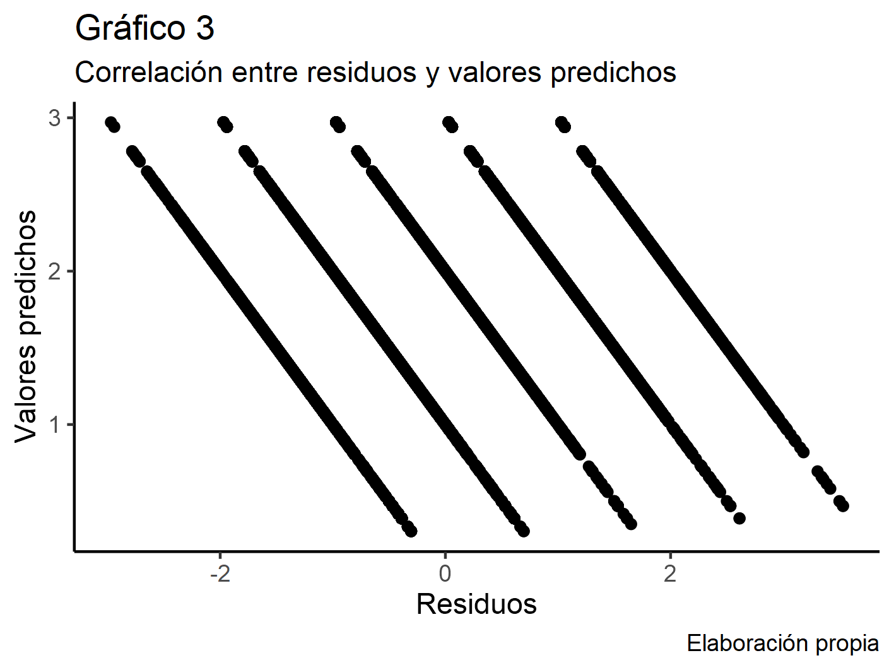
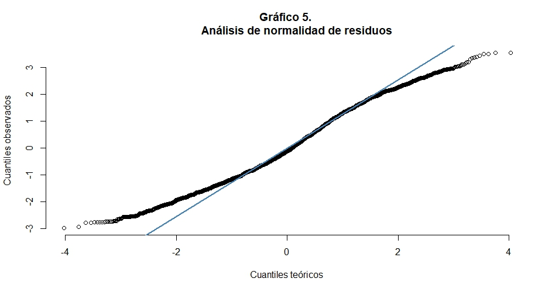

background-image: url("assets/logo/logo.png")
background-size: 15%
background-position: 100% 0%

```{r, load_refs, echo=FALSE, cache=FALSE, message=FALSE, warning=F}
# library(RefManageR)
# BibOptions(check.entries = FALSE, 
#            bib.style = "authoryear", 
#            cite.style = 'authoryear', 
#            style = "markdown",
#            hyperlink = FALSE, 
#            dashed = FALSE)
# myBib <- ReadBib("assets/example.bib", check = FALSE)
library(icons)
top_icon = function(x) {
  icons::icon_style(
    icons::fontawesome(x),
    position = "fixed", top = 10, right = 10
  )
}

library(tidyverse)
library(dplyr)
library(knitr)
library(kableExtra)
library(sjPlot)
library(lme4)
library(patchwork)
library(ggrepel)
library(performance)
library(car)
data = readRDS(url("https://github.com/nicolasggodoym/tesis/blob/main/output/data/data.rds?raw=true"))
final_fix = lmer(job_money ~ clase + UNION + SEX +ipo+(1|country), data)
lm_clase_ci <- lm(job_money ~ clase + UNION + SEX, data = data) 
```


background-image: url("assets/logo/logo.png")
background-size: 15%
background-position: 100% 0%

## Objetivos de investigación 


### Objetivo **general**

.content-box-red[

Analizar el **efecto** de factores de nivel **individual** y **contextual** asociados a las relaciones de clase en las actitudes hacia el trabajo remunerado

]

--

### Objetivos **específicos**

.content-box-red[

- Determinar el efecto de la *posición de clase* en la actitud mercantilizada hacia el trabajo remunerado. 
- Determinar el efecto de los *recursos de poder de la clase trabajadora* (estructural, asociativo y político-institucional) en la actitud mercantilizada hacia el trabajo remunerado. 
- Analizar el *efecto conjunto* de la posición de clase y los recursos de poder de la clase trabajadora en la actitud mercantilizada hacia el trabajo remunerado.

]

---
background-image: url("assets/logo/logo.png")
background-size: 15%
background-position: 100% 0%

## Antecedentes  
<br>
.large[**Explotación y enajenación: discutiendo la pérdida de la centralidad del trabajo**] 
<br>
.content-box-red[
- Ser humano y trabajo, capitalismo y enajenación .small[(Cohen, 2015; Marx, 2004, 2014; Jaeggi, 2014; Lukács, 1970; Rosa, 2016)].
- Enajenación y explotación; metafísica y ciencia .small[(Dahrendorf, 1962; Althusser, 2004)].
- La acción comunicativa y la deliberación como lo propiamente humano .small[(Arendt, 2019; Aguilar, 2001; Habermas, 1999, 2002)]. 
- El fin de la centralidad del trabajo .small[(Antunes, 2005; De la Garza y Toledo, 2000; De la Garza Toledo & Neffa, 2001; León & Zemelman, 1997)] y la pérdida de su sentido .small[(Sennett, 2019)].
- Una definición amplia del trabajo .small[(Noguera, 2002)], considerando las dimensiones
  + **Cognitivo-instrumental**;
  + Práctico-moral; y
  + Estético-expresiva.

]
---
background-image: url("assets/logo/logo.png")
background-size: 15%
background-position: 100% 0%

## Antecedentes  
<br>
.large[**Clase y actitudes: posición, articulación y conflicto**
]
<br>
.content-box-red[
- Las relaciones de clase como variable con poder explicativo en actitudes hacia
  + Políticas redistributivas .small[(Dodson, 2017)],
  + El conflicto y la cohesión social .small[(Edlund & Lindh, 
2015; Kelley & Evans, 1995; Pérez Ahumada 
& Andrade de la Horra, 2021; Ringqvist, 2021)]
  + La identidad de clase .small[(Elbert & Pérez, 2018)],
  + La intervención del Estado en la economía .small[(Pérez Ahumada, 2013)],
  + El trabajo (Svallfors, 2006)
]

---

background-image: url("assets/logo/logo.png")
background-size: 15%
background-position: 100% 0%

## Antecedentes  
<br>
.large[**Política de clases e instituciones. El trabajo asalariado en el capitalismo**
]
<br>
.content-box-red[
- Transformaciones institucionales en la economía
  + _Varieties of Capitalism (VoC)_: El enfoque funcionalista .small[(Hall & Soskice, 2001)].
  + **Aproximación de Recursos de Poder**: un análisis dinámico .small[(Korpi, 2006)]

- Balanza de las transformaciones económico-políticas a favor del capital .small[(Antía, 2019;  Bril-Mascarenhas & Maillet, 2019; Brookes, 2018; Carneiro et al., 2020; Fairfield, 2010, 2015a, 2015b; Fairfield & Garay, 2017; Pérez Ahumada, 2020; Thelen, 2001; Schmalz et al., 2018a; Streeck & Thelen, 2005)]
]
---
background-image: url("assets/logo/logo.png")
background-size: 15%
background-position: 100% 0%

## Antecedentes  
<br>
.large[**Política de clases e instituciones. El trabajo asalariado en el capitalismo**
]
<br>
.content-box-red[
- Neoliberalismo, flexibilidad, desregulación y autoritarismo en la relación capital-trabajo .small[(Aguilar, 
2001; Antía, 2019; Baccaro & Howell, 2011; Weller, 1998; Wright, 2015)]

- La dificultad del establecimiento de un acuerdo de clases: insuficiencia del rendimiento económico, problemas redistributivos e intensificación del conflicto (Alemán, 2008; Poulantzas, 1991; Rudra, 2002; Wright, 2015). 


]

---
background-image: url("assets/logo/logo.png")
background-size: 15%
background-position: 100% 0%

class: center, middle

### La condensación material del **conflicto de clase** en la configuración concreta de las relaciones capital-trabajo en las diversas formaciones sociales capitalistas, tiene por efecto la articulación de **relaciones sociales de producción** que propician la **enajenación** en la **relación que los trabajadores establecen con su trabajo**
---
background-image: url("assets/logo/logo.png")
background-size: 15%
background-position: 100% 0%

## Hipótesis

<br>

.content-box-red[

- $H_{1a}$: Las clases **despojadas de medios de producción** sometidas a formas múltiples de explotación presentarán actitudes más enajenadas hacia el trabajo. 
  + La **clase proletaria** presentará los valores más altos en su actitud mercantilizada hacia el trabajo.
  + Los **Expertos directivos** presentarán los valores más bajos en su actitud mercantilizada hacia el trabajo.
  + Los valores promedio de actitud mercantilizada hacia el trabajo serán mayores en quienes poseen activos de **cualificación**, respecto de quienes poseen activos de **autoridad**. 
  
$$
\begin{aligned}
  H1a: \beta_{p} < \beta_{dnc} < \beta_{ed}
\end{aligned}
$$


]

---
background-image: url("assets/logo/logo.png")
background-size: 15%
background-position: 100% 0%

## Hipótesis

<br>

.content-box-red[

- $H_{1b}$: Entre las clases **propietarias**, aquellas posiciones sometidas a **opresión económica** (Wright, 2015) presentarán actitudes más enajenadas hacia el trabajo. 
  + La **pequeña burguesía no profesional** presentará los valores más altos en actitud enajenada hacia el trabajo. 

$$
\begin{aligned}
  H1b: \beta_{pbnp} < \beta_{pbp} <= \beta_{c}
\end{aligned}
$$

- $H_{2}$: Formaciones sociales donde la clase trabajadora tenga mayores **recursos de poder** presentarán, en promedio, actitudes menos enajenadas hacia el trabajo.
  + Se espera que el efecto contextual del **Índice de Poder Obrero** en la actitud mercantilizada hacia el trabajo sea positivo en todos los países analizados.

$$
\begin{aligned}
  H2: \beta_{IPO} > 0
\end{aligned}
$$
]

---
background-image: url("assets/logo/logo.png")
background-size: 15%
background-position: 100% 0%

## Datos

- ISSP Work Orientations IV (2015)
  + 25 países
  + 17.610 observaciones

- Variable *dependiente*: **Actitud mercantilizada hacia el trabajo**
  + *A job is just a way of earning money – no more*
  + Item tipo Likert con 5 niveles 
  + Valor más alto indica mayor grado de acuerdo
  
- Variables *predictoras*: 
  + Nivel 1: **Posición de clase** (Wright, 2015)
  + Nivel 2: **Índice de Poder Obrero (IPO)**, promedio de valores estandarizados para el Poder Potencial de los trabajadores (Rudra, 2003), la densidad sindical (OIT, 2022) y el Índice de Derechos Laborales (Kucera y Sari, 2019)

---
background-image: url("assets/logo/logo.png")
background-size: 15%
background-position: 100% 0%
## La posición de clase (Wright, 2015)
<br>
- Posición ocupada por el individuo en el entramado de las relaciones sociales de producción, derivadas principalmente de las relaciones de 
propiedad, pero también de los mecanismos de exclusión relativos a la determinación de las condiciones en que se desenvolverá el proceso de trabajo. 

- **Opresión económica**: 
  + Principio de bienestar inverso
  + Principio de exclusión
  
- **Explotación**: opresión económica + apropiación de valor. 
---
background-image: url("assets/logo/logo.png")
background-size: 15%
background-position: 100% 0%

## La posición de clase (Wright, 2015)
```{r, echo = FALSE, out.height="90%", fig.height=4, out.width="90%", fig.align='center'}

```
---

```{r, echo=F, include = T, warning=F, out.width="60%", fig.align='center'}
data %>% 
  filter(if_any(c(job_money, clase, ends_with("std")), ~!is.na(.))) %>% 
  group_by(clase) %>% 
  summarise(m = mean(job_money)) %>% 
  ggplot(aes(x = clase, y = m, fill = "#FF3300")) +
  geom_bar(position = position_dodge(.2),stat = "identity", color = "black") +
  geom_text(aes(label=round(m,3)), vjust=1.5)+
  labs(title = "Media de actitud enajenada hacia el trabajo según clase social", 
       caption = "Elaboración propia en base a ISSP (2015)") +
  xlab("") +
  ylab("") + 
  scale_x_discrete(labels = function(x) str_wrap(x, width = 2)) +
  theme_classic() +
  theme(legend.position = "none")
```
---
background-image: url("assets/logo/logo.png")
background-size: 15%
background-position: 100% 0%
```{r, echo=F, include = T, warning=F, out.width="60%", fig.align='center'}
data %>% 
  filter(if_any(c(job_money, clase, ends_with("std")), ~!is.na(.))) %>% 
  group_by(country) %>% 
  summarise(m = mean(job_money)) %>% 
  filter(country %in% c("Alemania", "Australia","Chile", "Dinamarca", "Eslovaquia",
                        "España", "Estados Unidos de América (los)", "Finlandia", "México",
                        "Noruega", "Rusia")) %>% 
  ggplot(aes(x = reorder(country, -m), y = m, fill = "#FF3300")) +
  geom_bar(position = position_dodge(.2),stat = "identity", color = "black") +
  geom_text(aes(label=round(m,3)), vjust=0.4, hjust=1.3)+
  labs(title = "Media de actitud enajenada hacia el trabajo por país", 
       caption = "Elaboración propia en base a ISSP (2015)") +
  xlab("") +
  ylab("") + 
  coord_flip()+
  scale_x_discrete(labels = function(x) str_wrap(x, width = 10)) +
  theme_classic() +
  theme(legend.position = "none")
```
---
background-image: url("assets/logo/logo.png")
background-size: 15%
background-position: 100% 0%

## Recursos de poder
<br>
- **Poder**: capacidad de las clases capitalista y trabajadora para realizar sus intereses de clase, mutuamente contradictorios (Wright, 2000), frente a la otra clase y/o frente al Estado (Wright, 2015).
- **Conflicto** articulado en tres esferas (Wright, 2015)
  + El intercambio (mercado del trabajo),
  + La producción (proceso de trabajo), y
  + La política y administración.

- Los **recursos de poder** de la clase trabajadora (Schmalz et al., 2018b):
  + **Asociativo** (densidad sindical);
  + **Estructural** (P.P.T.): de mercado del trabajo (colectivo) y en el espacio de trabajo (individual);
  + **Político-institucional**(L.R.I.); y
  + Societal: comunicativo y de coalición.
---
background-image: url("assets/logo/logo.png")
background-size: 15%
background-position: 100% 0%
```{r, echo=F, include = T, warning=F,message=F, out.width="60%", fig.align='center'}
data %>% 
  filter(if_any(c(job_money, clase, ends_with("std")), ~!is.na(.))) %>% 
  group_by(country) %>% 
  summarise(m = ipo) %>% 
  filter(country %in% c("Alemania", "Australia","Chile", "Dinamarca", "Eslovaquia",
                        "España", "Estados Unidos de América (los)", "Finlandia", "México",
                        "Noruega", "Rusia")) %>% 
  ggplot(aes(x = reorder(country, -m), y = m, fill = "#FF3300")) +
  geom_bar(position = position_dodge(.2),stat = "identity", color = "black") +
  geom_text(aes(label=round(m,3)), vjust =1.5)+
  labs(title = "Índice de Poder Obrero (IPO) por país", 
       caption = "Elaboración propia en base a ISSP (2015)") +
  xlab("") +
  ylab("") +
  scale_x_discrete(labels = function(x) str_wrap(x, width = 10)) +
  theme_classic() +
  theme(legend.position = "none")
```
---
background-image: url("assets/logo/logo.png")
background-size: 15%
background-position: 100% 0%

## Metodología

### Método de análisis 

- Regresión lineal multinivel (REML)
- Estimación de interceptos y pendientes aleatorias
- 14 modelos
  + 4 de nivel 1
  + 8 con interceptos y pendientes aleatorias por país
  + 1 con interceptos aleatorios
  + 1 con interceptos aleatorios y efectos fijos
- Medidas de ajuste: AIC, BIC y Devianza

---
background-image: url("assets/logo/logo.png")
background-size: 15%
background-position: 100% 0%

class: center, middle

# Resultados

---
background-image: url("assets/logo/logo.png")
background-size: 15%
background-position: 100% 0%

```{r, echo=F, include = T, warning=F,message=F, out.width="60%", fig.align='center'}
p = data.frame(clases = factor(c("Proletario",
           "Obrero calificado",
           "Experto no directivo",
           "Directivo/supervisor no calificado",
           "Directivo/supervisor calificado",
           "Gerente",
           "Pequeña burguesia no profesional",
           "Pequeña burguesia profesional",
           "Capitalista"), levels = c("Proletario",
                                      "Obrero calificado",
                                      "Experto no directivo",
                                      "Directivo/supervisor no calificado",
                                      "Directivo/supervisor calificado",
                                      "Gerente",
                                      "Pequeña burguesia no profesional",
                                      "Pequeña burguesia profesional",
                                      "Capitalista")),
           pred = c(2.23,
                    2.23-.22,
                    2.23-.61,
                    2.23-.22,
                    2.23-.48,
                    2.23-.69,
                    2.23-.34,
                    2.23-.78,
                    2.23-.76))
           
p = p %>%
  rowwise() %>% 
  mutate(inf = pred - ((var(.$pred)/sqrt(10))*1.96),
         sup = pred + ((var(.$pred)/sqrt(10))*1.96)) %>%
  ungroup()

p %>% 
  ggplot(aes(x = clases, y = pred), 
         label = pred) +
  geom_point() + 
  geom_errorbar(aes(ymin = inf, ymax = sup, width = 0.2)) +
  geom_text(aes(label = pred), hjust =1.3) +
  labs(title = "Valores predichos promedio según clase social",
       subtitle = "",
       y = "", x ="",
       caption = "Elaboración propia") +
  guides(color = "none") +
  scale_color_discrete(name = "Clases sociales") +
  scale_x_discrete(labels = function(x) str_wrap(x, width = 10)) +
  theme_minimal()

```

---
background-image: url("assets/logo/logo.png")
background-size: 15%
background-position: 100% 0%

```{r, echo=F, include = T, warning=F,message=F, out.width="60%", fig.align='center'}
x <- data.frame(coef(final_fix)$country)

pais = sort(unique(data$country))
ipo = data %>% 
  select(pais = country, ipo) %>% 
  distinct(pais, ipo)
x <- data.frame(pais, b0 = coef(final_fix)$country)
x = merge(x, ipo, by = "pais")
row.names(x) = NULL
x %>% 
  select(1, 2, ipo) %>% 
  mutate_at(vars(2, 3), ~(round(., 3))) %>% 
  rowwise() %>% 
  mutate(pred = round(b0..Intercept. + (ipo*-.53), 3)) %>% 
  ungroup() %>% 
  ggplot(aes(x = ipo, y = pred)) +
  geom_point() + 
  geom_text_repel(aes(label=pais), max.overlaps = 25) +
  geom_smooth(method = "lm", colour = "black") + 
  labs(title = "Relación entre el IPO y los valores predichos para un obrero hombre
no sindicalizado",
       subtitle="",
       x ="IPO", y = "Valores predichos",
       caption = "Elaboración propia") +
  theme_minimal() 

```


---
background-image: url("assets/logo/logo.png")
background-size: 15%
background-position: 100% 0%

```{r, echo = F, out.width="110%", out.height="100%", fig.align='center'}

```

---

background-image: url("assets/logo/logo.png")
background-size: 15%
background-position: 100% 0%

## Resultados del análisis

<br>

### Nivel micro

- Existe una relación positiva entre el *sometimiento a múltiples tipos de explotación* y la actitud mercantilizada hacia el trabajo. 
- **Jerarquía** del efecto de los activos: autoridad, calificaciones y propiedad. 
- La **opresión económica** ejerce un positivo en la mercantilización de las actitudes hacia el trabajo en las clases propietarias

### Nivel macro

- El efecto del IPO sobre las actitudes al trabajo son *__positivos__ y fijos* entre países. 

---
background-image: url("assets/logo/logo.png")
background-size: 15%
background-position: 100% 0%

## Discusión

- El efecto de la **situación individual y contextual** de los sujetos en las **relaciones sociales de producción** sobre su **aproximación hacia el trabajo**
- El desarrollo histórico de las **contradicciones** del capitalismo ha significado el **empobrecimiento** de la relación entre las personas y sus labores productivas
  + La materialidad del vínculo entre **enajenación** y **explotación** .small[(Althusser, 2004; Dahrendorf, 1962; Jaeggi, 2014; Rosa, 2016)]
  + ¿Pérdida de **centralidad** o **pérdida de sentido**? .small[(Arendt, 2019; Aguilar, 2001; Antunes, 2005; De la Garza y Toledo, 2000; De la Garza Toledo & Neffa, 2001; Habermas, 1999, 2002; León & Zemelman, 1997; Lukács, 1970; Sennett, 2019)]
  

  
---
background-image: url("assets/logo/logo.png")
background-size: 15%
background-position: 100% 0%

## Limitaciones

- No cumplimiento del supuesto linealidad
- Falta de incorporación de predictores subjetivos

## .red[Proyecciones]

- Incorporar predictores subjetivos .small[(percepciones sobre clima laboral, actitudes hacia la desigualdad económica, etc.)] en el análisis.
- Incorporar nuevos predictores contextuales asociados a las relaciones de clase .small[(tasa de informalidad, días-persona perdidos, etc.)].
- Complejizar la medición del grado de enajenación hacia el trabajo en su multidimensionalidad.
- Incorporar el nivel de sector económico en el análisis.
- Analizar diferentes fenómenos subjetivos .small[(actitudes hacia la democracia, la corporativización de la economía, políticas redistributivas,  el autoempleo, etc.)] incorporando 

---

class: fdl-black
background-image: url("assets/logo/logo-blanco.png")
background-size: 15%
background-position: 100% 0%

# ¡Gracias!

.white[*Nicolás Godoy* - Tesista de pregrado]
<a href="mailto:nicolas.godoy.m@ug.uchile.cl">
.white[`r icons::icon_style(icons::fontawesome("paper-plane"), fill = "white")` nicolas.godoy.m@ug.uchile.cl]
</a>


<a href="https://github.com/nicolasggodoym">
.white[`r icons::icon_style(icons::fontawesome("github"), fill = "white")` @nicolasggodoym]
</a>


]]

.pull-left.white.middle[
FONDECYT N°11190229<br>*Determinantes institucionales y políticos del conflicto entre empresarios y trabajadores: los casos de Argentina y Chile en perspectiva comparada*]

---
background-image: url("assets/logo/logo.png")
background-size: 15%
background-position: 100% 0%

## Bibliografía (1)

- Aguilar, O. (2001). Tendencias y visiones sobre la crisis del trabajo. Programa de Estudios 
Desarrollo y Sociedad. Universidad de Chile
- Alemán, J. (2008). Labor Market Deregulation and Industrial Conflict in New Democracies: A Cross-National Analysis. Political Studies, 56(4), 830-856. 
https://doi.org/10.1111/j.1467-9248.2007.00707.x
- Althusser, L. (2004). La revolución teórica de Marx. Siglo XXI.
- Antía, F. (2019). The Political Dynamic of Redistribution in Unequal Democracies: The Center-Left Governments of Chile and Uruguay in Comparative Perspective. Latin American Perspectives, 46(1), 152-166. 
https://doi.org/10.1177/0094582X18806827
- Antunes, R. (2005). Los sentidos del trabajo: Ensayo sobre la afirmación y la negación del trabajo. Herramienta.
- Arendt, H. (2019). La condición humana (R. Gil Novales, Trad.; 1a edición, 6a impresión). Paidós.
- Baccaro, L., & Howell, C. (2011). A Common Neoliberal Trajectory: The Transformation of Industrial Relations in Advanced Capitalism. Politics & Society, 39(4), 521-563. https://doi.org/10.1177/0032329211420082

---
background-image: url("assets/logo/logo.png")
background-size: 15%
background-position: 100% 0%

## Bibliografía (2)

- Bril-Mascarenhas, T., & Maillet, A. (2019). How to Build and Wield Business Power: The Political Economy of Pension Regulation in Chile, 1990–2018. Latin American Politics and Society, 61(1), 101-125. https://doi.org/10.1017/lap.2018.61
- Brookes, M. (2018). Power Resources in Theory and Practice: Where to Go from Here. Global Labour Journal, 9(2). https://doi.org/10.15173/glj.v9i2.3571
- Carneiro, F., Fuentes, G., & Midaglia, C. (2020). Old Friends in New Times: Progressive Parties and Union Movements in the Southern Cone. Latin American Perspectives, 47(4), 112-130. https://doi.org/10.1177/0094582X20924368
- Cohen, G. A. (2015). La teoría de la historia de Karl Marx: Una defensa. Siglo XXI de España: Editorial Pablo Iglesias
- Dahrendorf, R. (1962). Las clases sociales y su conflicto en la sociedad industrial. RIALP.
- De la Garza Toledo, E. de la (Ed.). (2000). Tratado latinoamericano de sociología del trabajo (1. ed). Colegio de México: Facultad Latinoamericana de Ciencias Sociales: Universidad Autónoma Metropolitana: Fondo de Cultura Económica.

---
background-image: url("assets/logo/logo.png")
background-size: 15%
background-position: 100% 0%

## Bibliografía (2)

- De la Garza Toledo, E., & Neffa, J. C. (Eds.). (2001). El Futuro del Trabajo—El Trabajo del Futuro (Primera). Consejo Latinoamericano de Ciencias Sociales.
- Dodson, K. (2017). Economic Change and Class Conflict over Tax Attitudes: Evidence from Nine Advanced Capitalist Democracies. Social Forces, 95(4), 1509-1538. https://doi.org/10.1093/sf/sox027
- Edlund, J., & Lindh, A. (2015). The democratic class struggle revisited: The welfare state, social cohesion and political conflict. Acta Sociologica, 58(4), 311-328.https://doi.org/10.1177/0001699315610176
- Elbert, R., & Pérez, P. (2018). The identity of class in Latin America: Objective class position and subjective class identification in Argentina and Chile (2009). Current Sociology, 66(5), 724-747. https://doi.org/10.1177/0011392117749685
- Fairfield, T. (2010). Business Power and Tax Reform: Taxing Income and Profits in Chile and Argentina. Latin American Politics and Society, 52(2), 37-71.
- Fairfield, T. (2015a). Private Wealth and Public Revenue in Latin America: Business Power and Tax Politics. Cambridge University Press. https://doi.org/10.1017/CBO9781316104767

---
background-image: url("assets/logo/logo.png")
background-size: 15%
background-position: 100% 0%

## Bibliografía (3)
- Fairfield, T. (2015b). Structural power in comparative political economy: Perspectives from policy formulation in Latin America. Business and Politics, 17(3), 411-441. https://doi.org/10.1515/bap-2014-0047
- Fairfield, T., & Garay, C. (2017). Redistribution Under the Right in Latin America: Electoral Competition and Organized Actors in Policymaking. Comparative 
Political Studies, 50(14), 1871-1906. https://doi.org/10.1177/0010414017695331
- Habermas, J. (1999). Teoría de la acción comunicativa. Racionalidad de la acción y racionalización social (Taurus).
- Habermas, J. (2002). Teoría de la acción comunicativa. Tomo II. Taurus.
- Hall, P. A., & Soskice, D. (2001). An introduction to varieties of capitalism. En P. A. Hall & D. Soskice (Eds.), Varieties of Capitalism: The Institutional Foundations of Comparative Advantage (pp. 1-68). Oxford University Press.
- International Labour Organization. (2022). ILOSTAT. ILOSTAT. https://ilostat.ilo.org/es/
- Jaeggi, R. (2014). Alienation. Columbia University Press.

---
background-image: url("assets/logo/logo.png")
background-size: 15%
background-position: 100% 0%

## Bibliografía (4)

- Kelley, J., & Evans, M. D. R. (1995). Class and Class Conflict in Six Western Nations. American Sociological Review, 60(2), 157. https://doi.org/10.2307/2096382
- Korpi, W. (2006). Power resources and employer-centered approaches in explanations of welfare states and varieties of capitalism: Protagonists, consenters, and antagonists. World Politics, 58(2), 167-206. 
- Kucera, D., & Sari, D. (2019). New labour rights indicators: Method and trends for 2000–15. International Labour Review, 158(3), 419-446. https://doi.org/10.1111/ilr.12084
- León, E., & Zemelman, H. (Eds.). (1997). Subjetividad: Umbrales del pensamiento social (1. ed). Anthropos; Centro Regional de Investigaciones Multidisciplinarias, Universidad Nacional Autónoma de México.
- Lukács, G. (1970). Historia y Conciencia de Clase. Editorial de Ciencias Sociales.
- Marx, K. (2004). Manuscritos económico-filosóficos de 1844. Colihue.
- Marx, K. (2014). El capital—Tomo 1—Vol. 1. El proceso de producción del capital / Karl Marx (1. Aufl). Siglo Veintiuno Editores.

---
background-image: url("assets/logo/logo.png")
background-size: 15%
background-position: 100% 0%

## Bibliografía (5)

- Noguera, J. A. (2002). El concepto de trabajo y la teoría social crítica. Papers. Revista de Sociologia, 68, 141. https://doi.org/10.5565/rev/papers/v68n0.1445
- Pérez Ahumada, P. (2013). Encontrando lo que nunca estuvo perdido. Conciencia de clase y conflicto de clases en el régimen neoliberal chileno. Revista de Sociología, 28, 83-111. https://doi.org/10.5354/rds.v0i28.30716
- Pérez Ahumada, P. (2020). Why Is It So Difficult to Reform Collective Labour Law? Associational Power and Policy Continuity in Chile in Comparative Perspective. Journal of Latin American Studies, 1-25. https://doi.org/10.1017/S0022216X20000978
- Pérez Ahumada, P. (2023). Libro de Pablo. The University of Pittsburgh Press.
- Pérez Ahumada, P., & Andrade de la Horra, V. (2021). Clase, política y percepción del conflicto de clases en Chile. Revista Temas Sociológicos, 29, 323-353. https://doi.org/10.29344/07196458.29.2938
- Poulantzas, N. (1991). Estado, Poder y Socialismo (Segunda). Siglo XXI. 

---
background-image: url("assets/logo/logo.png")
background-size: 15%
background-position: 100% 0%

## Bibliografía (6)

- Ringqvist, J. (2021). How do union membership, union density and institutionalization affect perceptions of conflict between management and workers? European Journal of Industrial Relations, 27(2), 131-148. https://doi.org/10.1177/0959680120963546
- Rosa, H. (2016). Alienación y aceleración: Hacia una teoría crítica de la temporalidad en la modernidad tardía (1.a ed.). Katz Editores. https://doi.org/10.2307/j.ctvndv5zf
- Rudra, N. (2002). Globalization and the Decline of the Welfare State in Less-Developed Countries. International Organization, 56(2), 411-445.  https://doi.org/10.1162/002081802320005522
- Schmalz, S., Ludwig, C., & Webster, E. (2018). The Power Resources Approach: Developments and Challenges. Global Labour Journal, 9(2).  https://doi.org/10.15173/glj.v9i2.3569
- Sennett, R. (2019). La corrosión del carácter: Las consecuencias personales del trabajo enel nuevo capitalismo. Anagrama
- Streeck, W., & Thelen, K. A. (2005). Beyond continuity: Institutional change in advanced political economies. Oxford University Press.
- Svallfors, S. (2006). The moral economy of class: Class and attitudes in comparative perspective. Stanford University Press.

---
background-image: url("assets/logo/logo.png")
background-size: 15%
background-position: 100% 0%

## Bibliografía (7)

- Thelen, K. (2001). Varities of Labor Politics. En P. A. Hall & D. Soskice (Eds.), Varieties of Capitalism: The Institutional Foundations of Comparative Advantage (pp. 69-103). Oxford University Press.
- Weller, J. (1998). Los retos de la institucionalidad laboral en el marco de la transformación de la modalidad de desarrollo en América Latina (Serie Reformas Económicas). CEPAL.
- Wright, E. O. (1997). Class counts: Comparative studies in class analysis. Cambridge University Press; Maison des sciences de l’homme.
- Wright, E. O. (2000). Working-Class Power, Capitalist-Class Interests, and Class Compromise. American Journal of Sociology, 105(4), 957-1002. https://doi.org/10.1086/210397
- Wright, E. O. (2015). Understanding Class. Verso
---
background-image: url("assets/logo/logo.png")
background-size: 15%
background-position: 100% 0%
## Anexo 1: Relación entre variables de nivel 2
```{r, echo = F, out.width="110%", out.height="100%", fig.align='center'}

```

---
## Anexo 2: Tabla de regresión lineal
background-image: url("assets/logo/logo.png")
background-size: 15%
background-position: 100% 0%
```{r, echo = F, out.width="35%", out.height="35%", fig.align='center'}

```
---
background-image: url("assets/logo/logo.png")
background-size: 15%
background-position: 100% 0%

## Anexo 3: Tabla de regresión multinivel (1)
```{r, echo = F, out.width="35%", out.height="35%", fig.align='center'}

```
---
background-image: url("assets/logo/logo.png")
background-size: 15%
background-position: 100% 0%

## Anexo 4: Tabla de regresión multinivel (2)
```{r, echo = F, out.width="35%", out.height="35%", fig.align='center'}

```
---
background-image: url("assets/logo/logo.png")
background-size: 15%
background-position: 100% 0%

## Anexo 5: Tabla de regresión multinivel (3)
```{r, echo = F, out.width="35%", out.height="35%", fig.align='center'}

```
---
background-image: url("assets/logo/logo.png")
background-size: 15%
background-position: 100% 0%

## Anexo 6: Medidas de ajuste de todos los modelos
```{r, echo = F, out.width="40%", out.height="40%", fig.align='center'}

```
---
background-image: url("assets/logo/logo.png")
background-size: 15%
background-position: 100% 0%

## Anexo 7: Análisis de supuestos: Linealidad (1)

```{r, echo = F, out.width="65%", out.height="65%", fig.align='center'}

```

---
background-image: url("assets/logo/logo.png")
background-size: 15%
background-position: 100% 0%

## Anexo 8: Análisis de supuestos: Linealidad (2)
```{r, echo = F, out.width="65%", out.height="65%", fig.align='center'}
knitr::include_graphics("assets/linealidad_ipo.png")
```
---
background-image: url("assets/logo/logo.png")
background-size: 15%
background-position: 100% 0%

## Anexo 9: Análisis de supuestos: Homogeneidad de varianza
```{r, echo = T, out.width="110%", out.height="100%", fig.align='center'}
data$residuos <- residuals(final_fix)
data$abs_residuos <-abs(data$residuos)
data$residuos2 <- data$abs_residuos^2
modelo_levene <- lm(residuos2 ~ iso3c, data=data)
anova(modelo_levene)
```
---
background-image: url("assets/logo/logo.png")
background-size: 15%
background-position: 100% 0%

## Anexo 10: Análisis de supuestos: Normalidad de residuos
```{r, echo = F, out.width="75%", out.height="75%", fig.align='center'}

```
---
background-image: url("assets/logo/logo.png")
background-size: 15%
background-position: 100% 0%

## Anexo 11: Análisis de supuestos: Multicolinealidad
```{r, echo = F, out.width="50%", out.height="50%", fig.align='center'}
plot(check_collinearity(final_fix))
```
---
background-image: url("assets/logo/logo.png")
background-size: 15%
background-position: 100% 0%

## Anexo 12: Análisis de supuestos: Independencia de residuos
```{r, echo = T, out.width="65%", out.height="65%", fig.align='center'}
car::durbinWatsonTest(data$residuos)
```
---
background-image: url("assets/logo/logo.png")
background-size: 15%
background-position: 100% 0%

## Anexo 13: Análisis de supuestos: Casos influyentes
```{r, echo = F, out.width="50%", out.height="50%", fig.align='center'}
plot(check_outliers(final_fix))
```